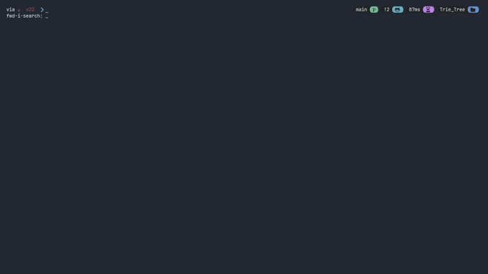

# <samp>Trie tree</samp>
Un árbol Trie (o árbol de prefijos) es una estructura de datos utilizada para almacenar un conjunto de cadenas, donde las cadenas que comparten un prefijo común comparten la misma ruta en el árbol. 


# <samp>Probar el programa</samp>
Para poder probarlo nos dirigimos al directorio [`../Trie_Tree/`](../Trie_Tree/), compilamos y ejecutamos la clase [`../Trie_Tree/TestTrie.java`](../Trie_Tree/TestTrie.java).

```sh
javac TestTrie.java
java TestTrie
```

| <b>Trie tree</b>                                                                                      |
|-------------------------------------------------------------------------------------------------------|
| <a href="#--------"></a>               |

